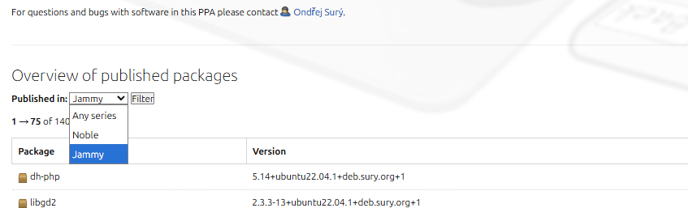

## Ubuntu 20.04 PPA 源失效😨
今早起来在祖传的 ubuntu 20 上安装 php 扩展，突然怎么都定位不到 package。
```bash
root@ubuntu:/# apt install php8.0
Reading package lists... Done
Building dependency tree       
Reading state information... Done
E: Unable to locate package php8.0
E: Couldn't find any package by glob 'php8.0'
root@ubuntu:/# apt install php7.1
Reading package lists... Done
Building dependency tree       
Reading state information... Done
E: Unable to locate package php7.1
E: Couldn't find any package by glob 'php7.1'
```
几个月前没出现过这个问题，配置环境也是老一套
```bash
apt update && apt upgrade -y
apt install software-properties-common
add-apt-repository ppa:ondrej/php
apt update

apt install php7.4 php7.3 php7.2 php8.2 php5.6
```
到 ppa:ondrej/php 中看看能不能找到原因，发现筛选按钮已经没有 focal 了（Ubuntu 20.04 LTS 的发行代号）



askubuntu 中也找到了一个相同的问题：

- [Failed to install PHP 8.3 on Ubuntu 20.04 - Ask Ubuntu](https://askubuntu.com/questions/1553270/failed-to-install-php-8-3-on-ubuntu-20-04)

> Ubuntu 20.04 LTS had five years of standard support which ended in April 2025, the extra month provided by Canonical ended on May 28, 2025.
> Ubuntu 20.04 LTS 有五年的标准支持，于 2025 年 4 月结束，Canonical 提供的额外一个月于 2025 年 5 月 28 日结束。
> 
> FYI: If you check launchpad.net/~ondrej/+archive/ubuntu/php you'll see rather quickly that the only releases that PPA supports is jammy (22.04) and noble (24.04) or the currently supported LTS releases. A standard PPA will only build for releases in standard support, which doesn't apply for focal or 20.04 any longer; so looking for PPAs isn't a solution for focal & hasn't been awhile now (PPAs still providing packages for focal may now be rather stale so do your homework first if you value security!!)
> 仅供参考：如果您检查 launchpad.net/~ondrej/+archive/ubuntu/php 您很快就会发现 PPA 支持的唯一版本是 jammy （22.04） 和 noble （24.04） 或当前支持的 LTS 版本。 标准 PPA 将仅针对标准支持中的版本构建，不再适用于 focal 或 20.04;因此，寻找 PPA 并不是 focal 的解决方案，而且已经有一段时间了（ 仍在为 focal 提供软件包的 PPA 现在可能相当陈旧，所以如果您重视安全性，请先做功课！！

